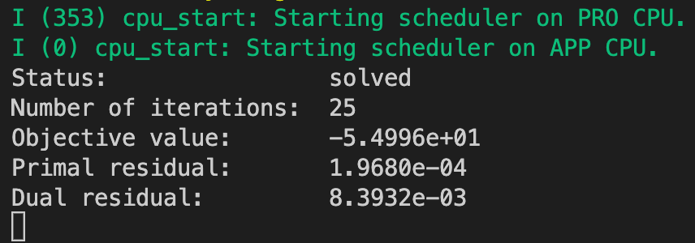
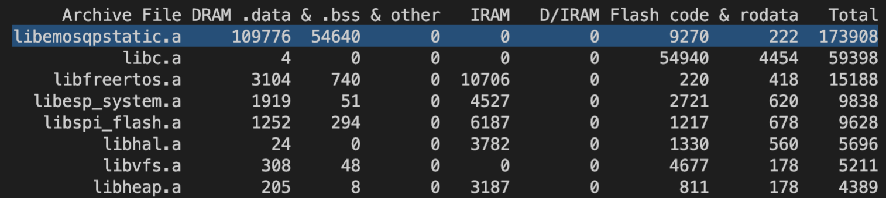
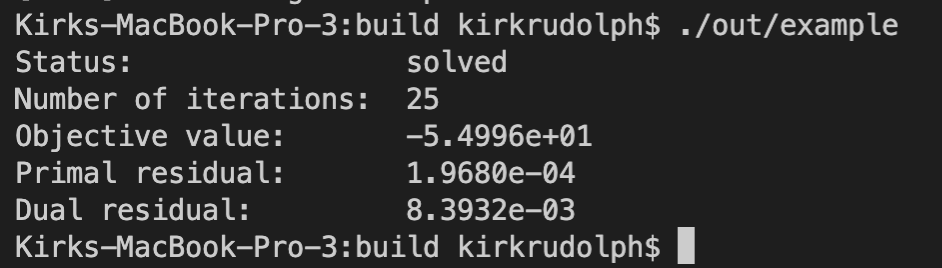

# ESP OSQP
[OSQP](https://osqp.org/) is an open-source, efficient, and robust numerical optimization package for solving convex quadratic programs. 

This repository is an example of how to implement OSQP on an embedded controller for model predictive control (MPC).

## Workflow
1. MPC problem is designed in a high level language (MATLAB or Python). For example, see [kirkrudolph/osqp-python](https://github.com/kirkrudolph/osqp-python) which uses an example from OSQP to simulate a 12 state model of a quadcopter. The python interface is capable of generating a solver in c code for the specific problem.
2. Take the generated c code and compile for an embedded microcontroller. This repo uses an ESP32 microcontroller.

## OSQP Generated Code on Embedded Microcontroller

The image below shows the microcontroller's output from building this repository and flashing it to an ESP32. I'd like to test generated code using `FLOAT` instead of `DOUBLE`.



After measuring performance, it's much worse than I was hoping. The statistics are summarized in the following table:

- Average over 10 solves
  - 25 Iterations / solve
  - Almost no variability b/c initial states were always the same.
- O2 Compiler Optimization
- Percision [(FLOAT and LONG)](https://osqp.org/docs/codegen/python.html#codegen) didn't change the generated code.
- Number of Non-zero (nnz)

| CPU Freq (MHz) | States / Actuators (#) | Horizon (#) | Variables (n) | Constraints (m) | nnz(P) + nnz(A) | Time / solve (ms) |
|:--------------:|:----------------------:|:-----------:|:-------------:|:---------------:|:---------------:|:-----------------:|
|       160      |         12 / 4         |     10      |     139       |       139       |       842       |      235.0        |
|       240      |         12 / 4         |     10      |     139       |       139       |       842       |      156.0        |

The required microcontroller resources are also significant (~174 kB Total):



## OSQP Generated Code on MacOS

The image below shows the macbook output from building the python generated code into a native executable.



| CPU Freq (MHz) | States / Actuators (#) | Horizon (#) | Variables (n) | Constraints (m) | nnz(P) + nnz(A) | Time / solve (ms) |
|:--------------:|:----------------------:|:-----------:|:-------------:|:---------------:|:---------------:|:-----------------:|
|      2300      |          9 / 3         |      2      |      33       |        60       |       164       |      -----        |
|      2300      |          9 / 4         |      2      |      35       |        62       |       186       |      0.028        |
|      2300      |         12 / 4         |      2      |      44       |        80       |       257       |      0.035        |
|      2300      |          9 / 3         |      5      |      69       |       123       |       377       |      -----        |
|      2300      |          9 / 4         |      5      |      74       |       128       |       432       |      0.060        |
|      2300      |         12 / 4         |      5      |      92       |       164       |       596       |      0.085        |
|      2300      |          9 / 3         |     10      |     129       |       228       |       732       |      -----        |
|      2300      |          9 / 4         |     10      |     139       |       238       |       842       |      0.125        |
|      2300      |         12 / 4         |     10      |     172       |       304       |      1161       |      0.180        |
|      2300      |          9 / 3         |     30      |     369       |       648       |      2152       |      -----        |
|      2300      |          9 / 4         |     30      |     399       |       678       |      2482       |      -----        |
|      2300      |         12 / 4         |     30      |     492       |       864       |      3421       |      -----        |

## Next Step: Performance Improvements
- [Fast MPC](https://web.stanford.edu/~boyd/papers/pdf/fast_mpc.pdf)

## Other Resources
- [Converter MPC to QP Form](https://robotology.github.io/osqp-eigen/md_pages_mpc.html)

OSQP C Interface (instead of python)
- [Build From Source](https://osqp.org/docs/get_started/sources.html#build-the-binaries)

```
rm -dr osqp/build
cmake -S osqp -B osqp/build
make -C osqp/build
./osqp/build/out/osqp_demo
```
